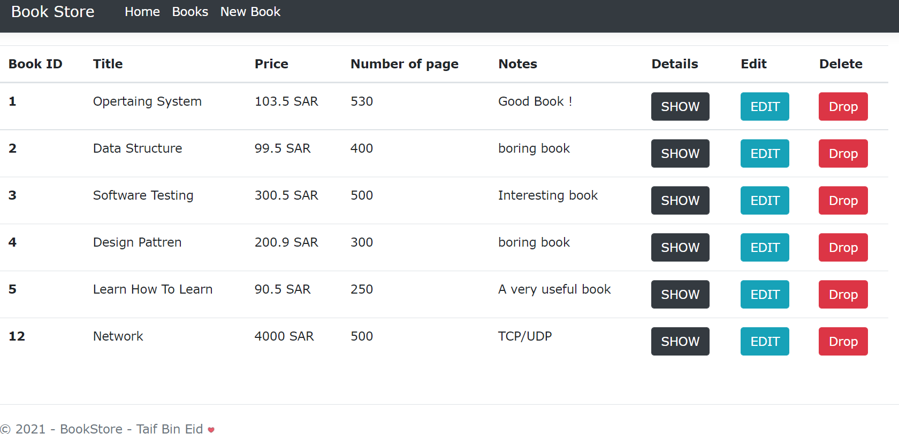
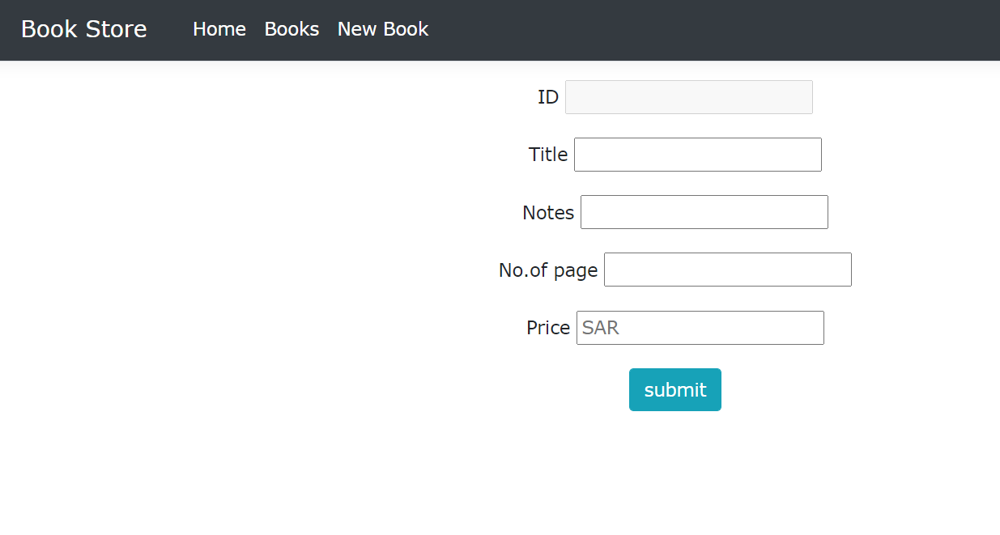

# Project03_CRUD_With_ASP.NET_MVC

# فكرة المشروع 

مشروع متجر كتب يعرض مجموعة من أنواع الكتب المختلفة تم بنائه  ASP.NET MVC
وتم تطبيق مفاهيم  Entity Framework Core 

CRUD
حيث يضيف كتاب جديد و يستعرض جميع الكتب من قاعدة البيانات ويحدث معلومات الكتب الموجودة في قاعدة البيانات بالإضافه الى حذف الكتب 

### Screenshots

 

> Display all books and information 

 

> Add new book to list of books 

